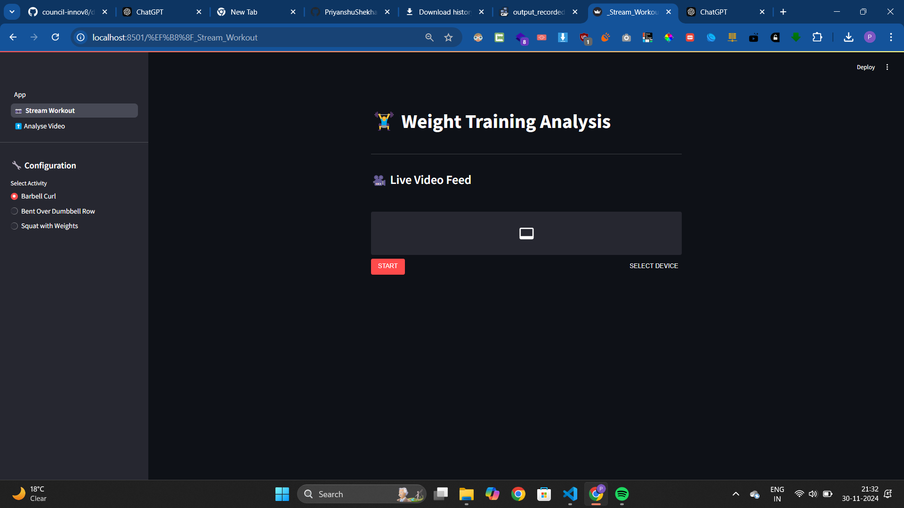
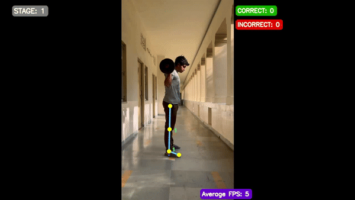

# Weight Training Analysis

## Introduction

This project focuses on **Weight Training Analysis** using Mediapipe for pose detection and real-time feedback. It is designed to assist users in performing exercises with proper form and posture, enhancing both safety and performance.

---

## Features

- **Real-Time Feedback:** Analyze exercises in real-time using your webcam.
- **Video Analysis:** Upload workout videos for detailed analysis.
- **Activity Options:** Supports exercises such as:
  - Barbell Curl
  - Bent Over Dumbbell Row
  - Squat with Weights
- **Pose Detection:** Uses Mediapipe for tracking body joints and angles.
- **Error Detection:** Highlights posture errors and provides corrective suggestions.

---

## Demo

#### Interface




### Final Output



---

## Installation

### Prerequisites

Make sure you have the following installed:

- Python 3.8+
- FFmpeg (for video processing)

### Steps

1. Clone this repository:

   ```bash
   git clone https://github.com/Priyanshushekhar10/ai-workout-tracker.git
   cd ai-workout-tracker
   ```

2. Install the required dependencies:

   ```bash
   pip install -r requirements.txt
   ```

3. Run the application:
   ```bash
   streamlit run App.py
   ```

---

## Usage

### Stream Workout

1. Go to the **Stream Workout** tab.
2. Select your activity from the left-hand menu.
3. Start the live video feed by clicking **Start**.
4. Perform your exercise, and receive real-time feedback on your posture.

### Analyze Video

1. Go to the **Analyze Video** tab.
2. Upload a pre-recorded workout video by clicking **Browse files** or dragging the file into the upload area.
3. Select the activity type and click **Upload**.
4. View the analyzed video with posture corrections and metrics highlighted.
5. You can download the processed video once the analysis is complete.

---

Install all dependencies using:

```bash
pip install -r requirements.txt
```

---

## Demo


## Contributing

Contributions are welcome! Feel free to fork this repository, open issues, or submit pull requests.

---

## License

This project is licensed under the MIT License. See the LICENSE file for details.

---

## Author

**Priyanshu Singh**  
ID: 2021B5AB2797P

If you encounter any issues or have suggestions for improvement, please feel free to reach out.

---
